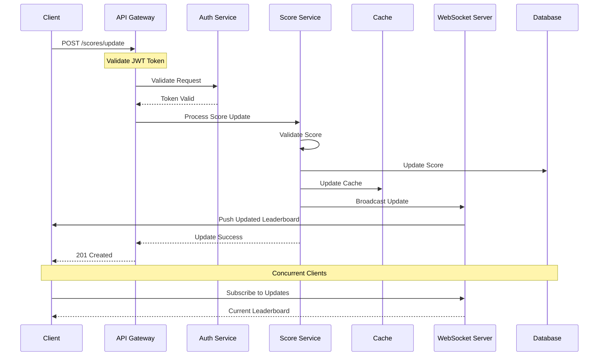
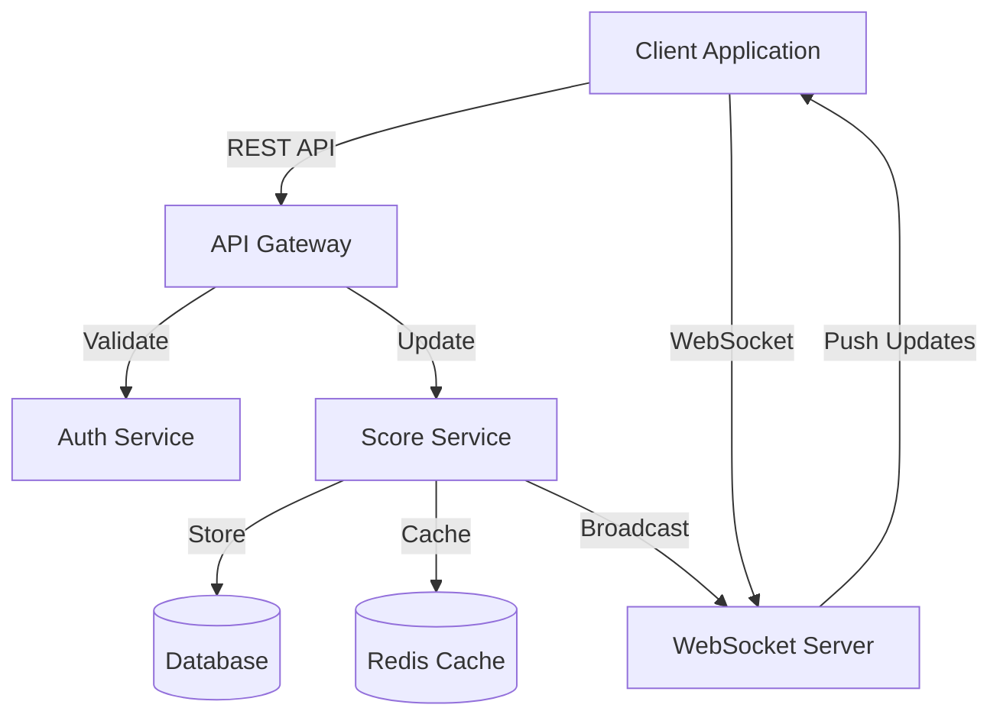

# Live Scoreboard Module Specification

## Overview

This specification outlines the implementation of a real-time scoreboard system that displays the top 10 users' scores. The system must handle secure score updates and provide live updates to connected clients.

## System Components

### 1. Core Components

- Score Update API
- WebSocket Server
- Score Storage Service
- Authentication Middleware
- Rate Limiter

### 2. Key Features

- Real-time score updates
- Secure score submission
- Top 10 leaderboard
- Rate limiting
- Score validation
- User authentication

## Technical Architecture

### Data Model

```typescript
interface User {
  id: string;
  username: string;
  currentScore: number;
  lastUpdateTimestamp: Date;
}

interface ScoreUpdate {
  userId: string;
  actionId: string; // Unique identifier for each action
  scoreIncrement: number;
  timestamp: Date;
}
```

### API Endpoints

#### 1. Score Update

```
POST /api/v1/scores/update
Authorization: Bearer <token>
```

Request body:

```json
{
  "actionId": "unique-action-id",
  "scoreIncrement": number
}
```

Response:

```json
{
  "userId": "user-id",
  "newScore": number,
  "rank": number
}
```

#### 2. Get Leaderboard

```
GET /api/v1/leaderboard
```

Response:

```json
{
  "lastUpdated": "ISO-8601-timestamp",
  "leaderboard": [
    {
      "rank": number,
      "userId": "user-id",
      "username": "string",
      "score": number
    }
  ]
}
```

### WebSocket Events

1. **Connection**

   - Event: `connect`
   - Client subscribes to leaderboard updates

2. **Leaderboard Update**
   - Event: `leaderboard_update`
   - Server pushes new leaderboard data

### Security Requirements

1. **Authentication**

   - JWT-based authentication
   - Token must contain user ID and permissions

2. **Score Validation**

   - Maximum score increment per action: 100 points
   - Minimum time between updates: 1 second
   - Action IDs must be unique and verifiable

3. **Rate Limiting**
   - Maximum 10 score updates per minute per user
   - Maximum 5 concurrent WebSocket connections per user

## Caching Strategy

1. **Leaderboard Cache**

   - Cache top 10 scores in Redis
   - TTL: 1 minute
   - Update on score changes

2. **User Score Cache**
   - Cache individual user scores
   - TTL: 5 minutes
   - Update on score submission

## Error Handling

### HTTP Status Codes

- 200: Success
- 201: Score updated successfully
- 400: Invalid request
- 401: Unauthorized
- 429: Too many requests
- 500: Server error

### Error Response Format

```json
{
  "error": {
    "code": "ERROR_CODE",
    "message": "Readable message",
    "details": {}
  }
}
```

## Testing Requirements

1. **Unit Tests**

   - Score validation logic
   - Rate limiting logic
   - Authentication middleware

2. **Integration Tests**

   - Score update flow
   - WebSocket connection handling
   - Caching behavior

3. **Load Tests**
   - Concurrent WebSocket connections
   - High-frequency score updates




